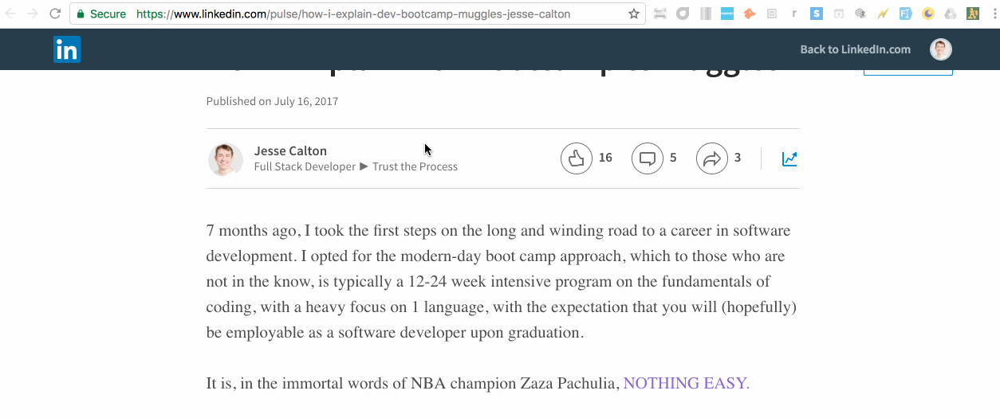

# Run Rickey Run!

Rickey Henderson, a Hall of Fame outfielder with the Oakland Athletics, was a big personality who was known for talking in the third-person. Such a privilege is earned, not given.

Rickey Henderson played 25 Major League seasons, is a two-time World Series winner, and has the all-time record for stolen bases at 1,406. As it stands, this record is widely regarded as one that will never be broken.

**Run Rickey Run** is a fun Chrome Extension that makes a web page look like it was written by The Greatest of All Time

---
### *Run Rickey Run* changes every instance of first-person pronouns on a web page to "Rickey Henderson," and updates the web page's styling to cool Oakland A's colors!

* Example: "I don't like it when I can't find my limo" gets changed to "Rickey Henderson don't like it when Rickey Henderson can't find Rickey Henderson's limo."

---

## Demo

## Deployment

## Rickey Stories ⚾

[Former Big Leaguer Harry Reynolds telling Rickey stories](https://youtu.be/9-1LGUOvpDM)

[Top Ten Times Rickey Henderson referred to himself in the third person](https://www.fanhospitality.com/blog/2017/04/10/top-10-times-rickey-henderson-referred-to-himself-in-the-third-person/)

## G.O.A.T 🐐

Credit: (http://baseballhall.org/hof/henderson-rickey)
